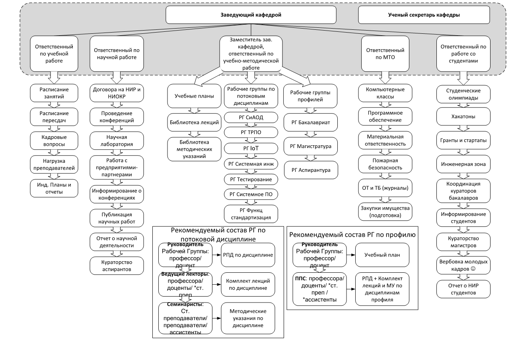

# Характеристика объекта автоматизации

Орагнизационная структура кафдеры представлена на рисунке ниже.

Исходя из структуры кафедры можно выделить следующих сотрудников:

- Преподаватель
- Методист
- Зам. зав. каф. по учебной работе
- Зам. зав. каф. по научной работе
- Зам. зав. каф. по учебно-методической работе
- Ответственный МТО
- Ответственный по работе со студентами
- Учёный секретарь
- Зав. кафедрой

## Методист

Основные обязанности:

- Работа с индивидуальными планам
  - Создание
  - Просмотр
  - Редактирование
  - Удаление
- Работа с расписанием
  - Создание
  - Просмотр
  - Редактирование

* Работа с кадровыми вопросами
  * Выдача справок
  * Создание заявлений на повышение/понижение ставки
  * Составление табелей