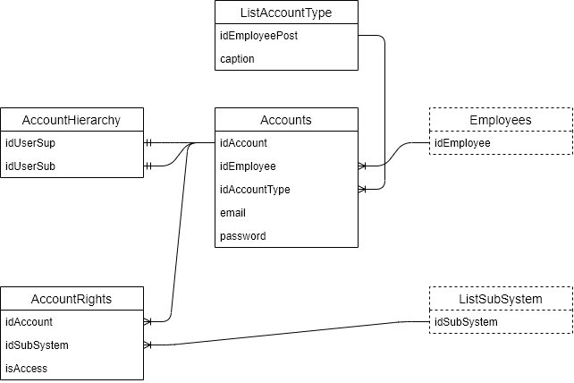

# Подсистема пользователей

Отвечает за хранение аккаунтов пользователей системы, иерархию и их права доступа.

## Круг пользователей

* Преподаватели
* Методисты
* Зам. зав. каф. по учебной работе
* Зам. зав. каф. по научной работе
* Зам. зав. каф. по учебно-методической работе
* Ответственный по МТО
* Ответственный по работе со студентами
* Зав. кафедры
* Учёный секретарь

## Данные подсистемы

К основным данным относятся:

- аккаунты пользователей (Accounts)
- типы пользователей (ListAccountType)
- иерархия пользователей (AccountHierarchy)
- права доступа (AccountRights)

### Аккаунты пользователей

Каждый аккаунт пользователя содержит следующие поля:

- Сотрудник, к кому привязан аккаунт
- Электронную почту (почта должна быть служебной) 
- Пароль
- Тип аккаунта

### Типы пользователей

Каждый тип пользователя содержит сооветствующее наименование. Сами типы пользователей совпадают со списком пользователей системы.

### Иерархия пользователей

Иерархия пользователей представляет собой набор отношений между пользователем начальник-подчинённый. В связи с этим можно выделить два поля:

- пользователь-начальник
- пользователь-подчинённый

