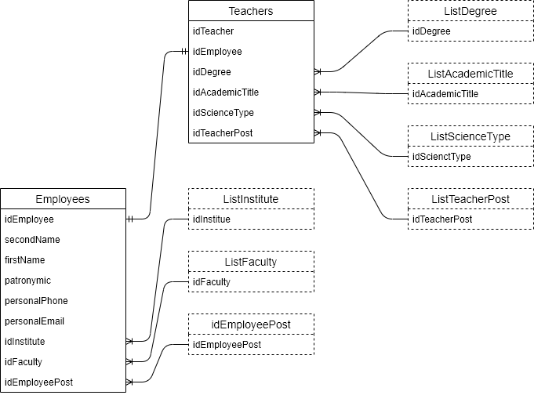

# Подсистема кадров

Отвечает за хранение кадровой информации сотрудников.

## Круг пользователей

* Методисты
* Зав. кафедры

## Данные подсистемы

К основным данным относятся:

- сотрудники (Employees)
- информация о преподавателях (Teachers)

### Сотрудники

Базовая информация о сотруднике включает в себя:

- ФИО
- Телефон (личный)
- Телефон (рабочий)
- Электронная почта (личная)
- Институт
- Кафедра
- Должность
- Ставки (штатная, внутренняя, внешняя)

### Информаця о преподавателе

Информация о сотруднике расширяется в случае, если сотрудник является преподавателем. Что включает в себя

- Учёное звание
- Учёную степень
- Должность преподавателя

